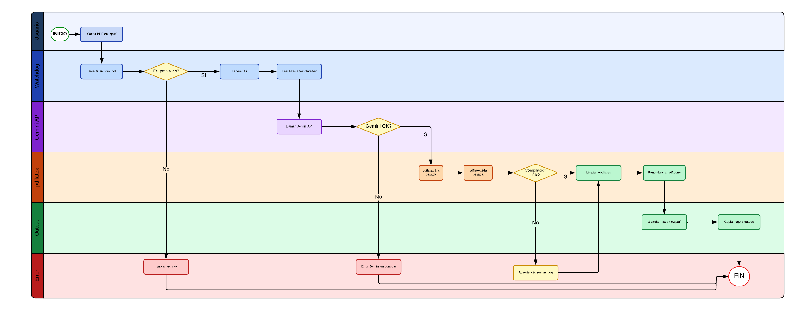

# ICN292-CURSOR
# 📁 PDF → LaTeX Converter


Pipeline local que convierte PDFs automáticamente a documentos LaTeX compilados, usando Gemini como motor de conversión y `pdflatex` para compilar localmente.

---

## 🏛️ Estructura del proyecto

```
pdf-a-latex/
├── input/                  ← Soltar aquí el PDF a convertir
├── output/                 ← Aparece el .tex y el .pdf generado
├── template.tex            ← Formato base (dos columnas, estilo UTFSM)
├── logonegrousm.png        ← Logo institucional
├── converter.py            ← Script principal
├── .env                    ← API key de Gemini 
├── .env.example            ← Ejemplo de configuración
└── requirements.txt        ← Dependencias Python
```

---

## 🏗️ Flujo de proceso



### 📋 Descripción de la secuencia

1. **Usuario** Soltar un archivo `.pdf` en la carpeta `input/`
2. **Watchdog** detectar el archivo nuevo automáticamente
3. Valida que sea un `.pdf` válido — si no lo es, se ignora
4. El script espera 1 segundo para asegurar que la copia esté completa
5. Se leen los bytes del PDF junto con el contenido de `template.tex`
6. Se llama a la **API de Gemini** enviando el PDF y el template como contexto
7. Gemini genera el código LaTeX respetando exactamente el formato definido
   - Si Gemini falla, se imprime el error en consola y se detiene el proceso
8. **pdflatex** compila el `.tex` en dos pasadas para resolver referencias cruzadas y `hyperref`
   - Si la compilación falla, se genera una advertencia y se continúa de todas formas
9. Se limpian los archivos auxiliares (`.aux`, `.log`, `.out`, `.toc`)
10. Se guardan `.tex` y `.pdf` en `output/`, y se copia el logo institucional
11. El PDF original en `input/` queda renombrado como `.pdf.done`
12. **Watchdog** vuelve a esperar nuevos archivos

---

## ⚒️Setup

### ⚡️ 1. Instalar dependencias

```bash
pip install -r requirements.txt
```

### 🔑 2. Configurar API key de Gemini

```bash
cp .env.example .env
```

Edita `.env` y agrega tu API key:

```
GEMINI_API_KEY=tu_api_key_aqui
```

### 🎓 3.Agregar el logo

Copiar `logonegrousm.png` en la raíz del proyecto.

### 👟 4.Ejecutar

```bash
python3 converter.py
```

Luego soltar cualquier PDF en `input/` y esperar el resultado en `output/`.

Para detener el script: `Ctrl+C`

---

## 📋Requisitos

- Python 3.9+
- MacTeX instalado
- API key de Gemini (Google AI Studio, plan gratuito)

